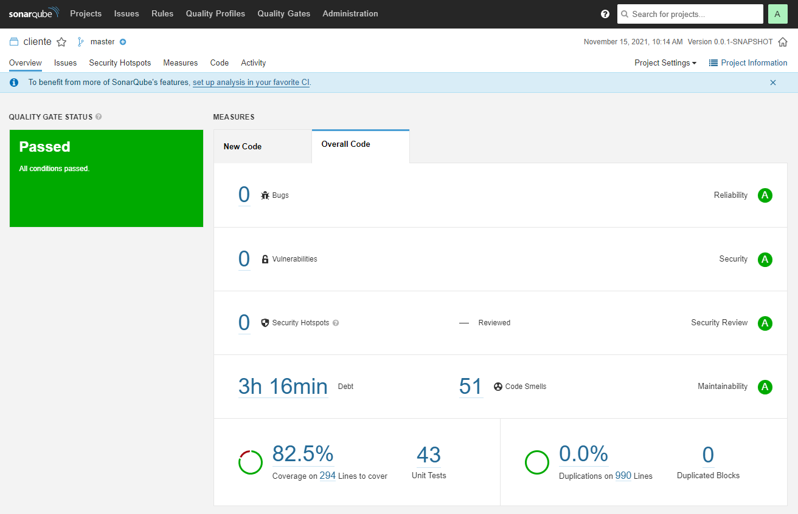

# Desafio Builder

Este projeto foi desenvolvido utilizando as tecnologias e conceitos abaixo:

- Java 11
- Spring boot
- Banco de dados postgres
- Banco de dados h2 (para teste de componente)
- Lombok
- ModelMapper
- Jacoco
- Sonar
- JUnit
- Exception Handler
- Pageable
- Postman Json
- Actuator (http://localhost:8090/actuator/health)
- Swagger (http://localhost:8090/swagger-ui.html)
- Docker Compose (para a aplicação e o banco de dados postgres)

## Installation

Para executar o projeto é ncessário ter o Docker e Docker Compose instalado na máquina.

Com o docker compose instalado vá até a raiz do projeto (diretório que se encontra o docker-compose.yml).
Execute os dois comando abaixo:

```sh
-> docker-compose build
-> docker-compose up
```

O projeto estará disponível no endereço abaixo:

```sh
http://localhost:8090/clientes
```

## Sonar

O projeto utilizou o SonarQube para avaliar parte da qualidade de código via cobertura de testes.
Abaixo está um print da análise do sonar para este projeto:



É possível reproduzir o resultado acima localmente utilizando o docker.
Para isso siga os passos abaixo:
- Execute:
```sh
docker run -d --name sonarqube -e SONAR_ES_BOOTSTRAP_CHECKS_DISABLE=true -p 9000:9000 sonarqube:latest
```
- abra o navegado no endereço:
```sh
 http://localhost:9000/
```
- login: admin
- senha: admin
- cadastre uma nova senha: 123
- escolha a opção de criar projeto manualmente
- project display name: cliente
- project key: cliente
- escolha analisar o projeto localmente
- Provide a token -> Generate a token: cliente
- escolha a análise do projeto pelo build Maven
- copie o script Scanner gerado. exemplo:

```sh
 mvn clean verify sonar:sonar \
  -Dsonar.projectKey=cliente \
  -Dsonar.host.url=http://localhost:9000 \
  -Dsonar.login=f86a33d65a073a2d08dff1034f30dfb55b88c2e0
```

- vá até a raiz do projeto onde se encontra o arquivo pom.xml e execute o comando acima
- Isso dará o resultado da cobetura pelo sonar.
